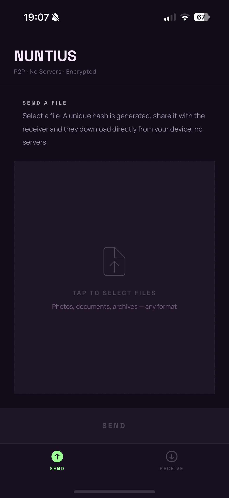
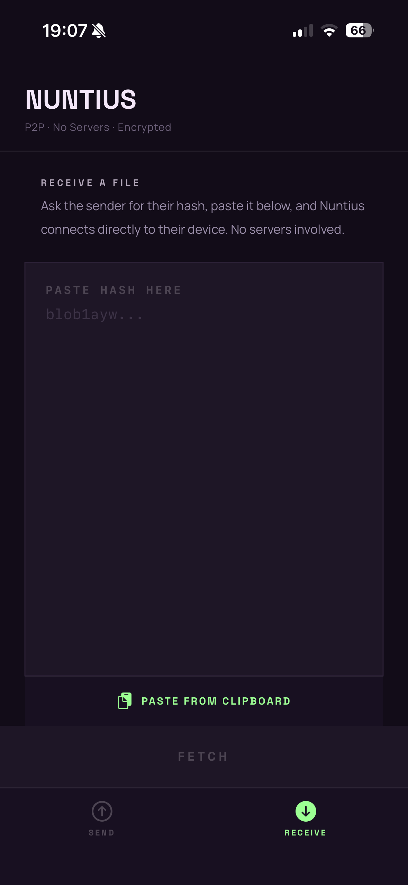
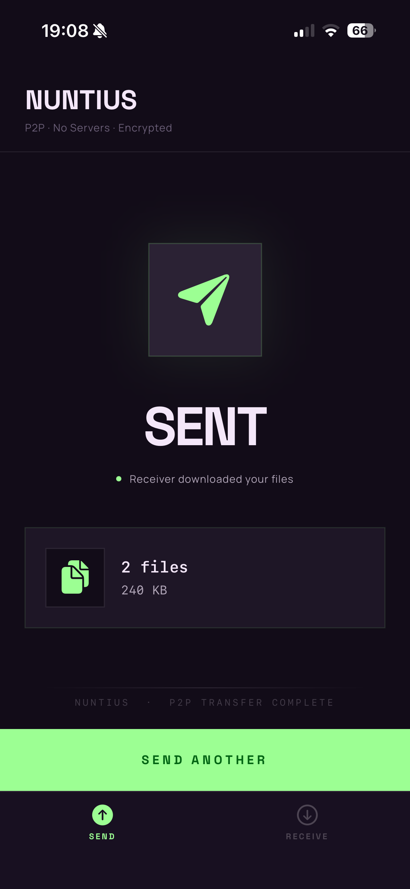

# Nuntius

P2P file sharing for iOS. Send files directly to another device with no servers, no accounts, and no cloud.

Built with Swift and [iroh](https://www.iroh.computer/) for peer-to-peer networking via a Rust FFI layer.

<p align="center">
  
  
  
</p>

## How it works

The sender picks files and gets a ticket. The receiver pastes the ticket and the files transfer directly between devices over an encrypted P2P connection — no relay, no servers, no cloud.

## sendme compatibility

Nuntius is 100% compatible with [sendme](https://www.iroh.computer/sendme), the official iroh file transfer tool. A ticket generated in Nuntius can be received by sendme on any platform, and vice versa.

## Build

**1. Build the Rust FFI library**

```bash
cd nuntius-ffi && ./build-ios.sh
```

**2. Open and run in Xcode**

```
Nuntius/Nuntius.xcodeproj
```

Requires Xcode and a physical iPhone (sideloading).

## References

- [iroh](https://www.iroh.computer/) — the P2P networking library powering the transfers
- [sendme](https://www.iroh.computer/sendme) — the official iroh file transfer tool, cross-platform compatible with Nuntius
- [iroh-ffi](https://github.com/n0-computer/iroh-ffi) — Rust FFI bindings for Swift and other languages via uniffi-rs
- [uniffi-rs](https://github.com/mozilla/uniffi-rs) — Mozilla's framework for generating FFI bindings from Rust
